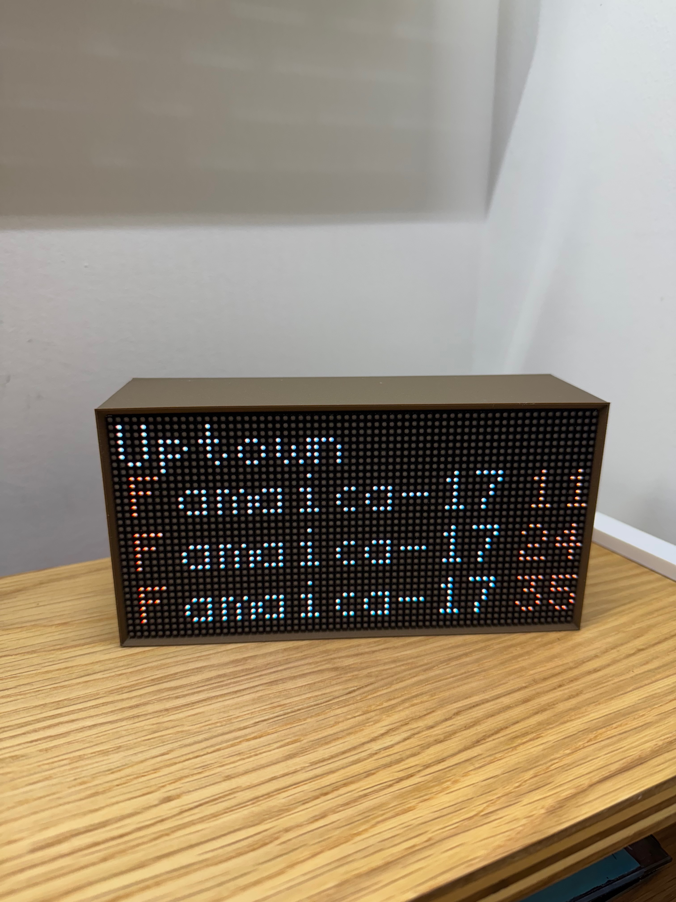
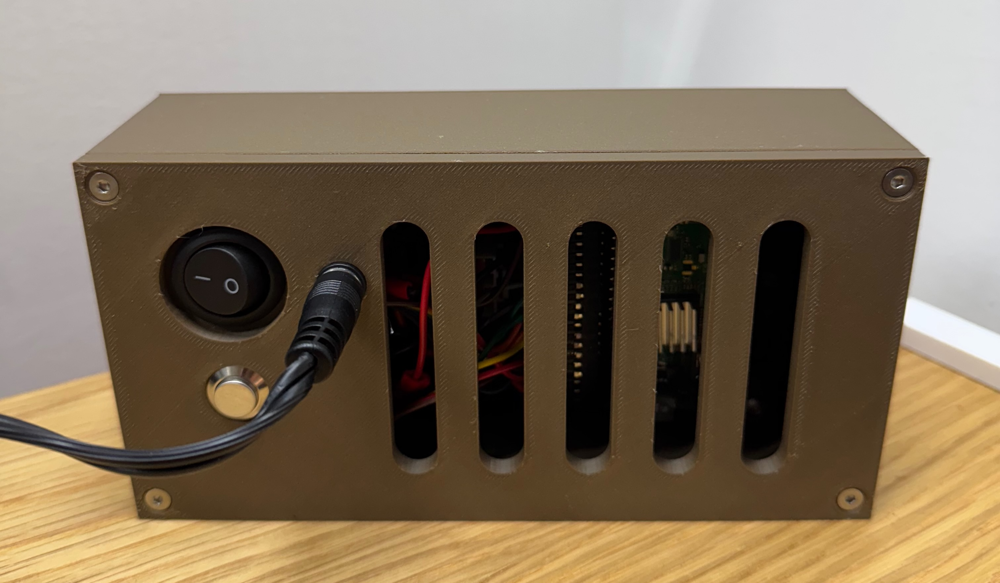
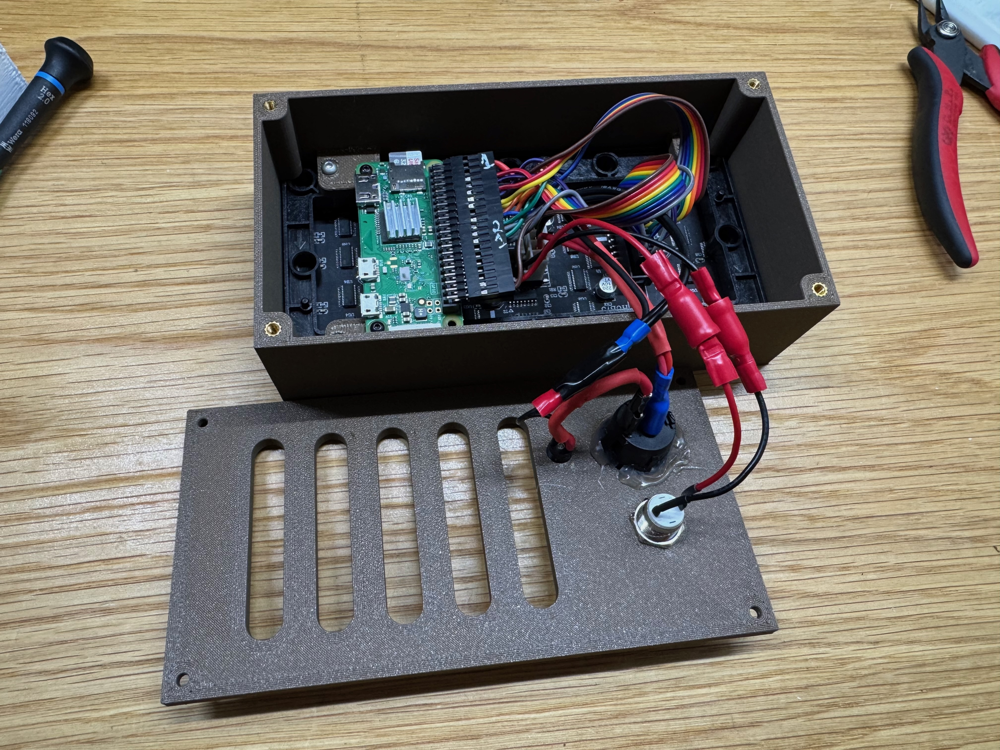

# NYC Subway Time LED Matrix Display
## Overview

This project was derived from https://github.com/techytobias/NYC-Subway-Display/. Changes to this version:
- Displays 4 screens on a loop related to trains at 34th st Herald Square: BDFM Uptown, BDFM Downtown, NQRW Uptown, NQRW Downtown.
- Removal of the disruptions screen.
- The MTA no longer requires API keys to access the subway feed.
- Utilizes a Raspberry Pi Zero W with no driver (underpowered for this project, likely causing the screen flickering).
- Inclusion of Fusion 360 files for enclosure

#### Capabilities
- Display times for arriving uptown and downtown trains at any NYC subway station
- Rotate through time displays for multiple stations

Demo:

Front of Display

Back of Display

Display Internals

## Materials
- Raspberry Pi Zero W (again, unpowered for this application)
- SD Card (8GB Class 10 or better)
- LED Matrix. I used [this Adafruit one, which is 64 x 32 with a 2.5mm led spacing](https://www.adafruit.com/product/5036)
- Adequate power for the display and Pi -- I used [this adapter](https://www.adafruit.com/product/1466).

## Before You Begin This Guide
- Follow [this setup](https://github.com/hzeller/rpi-rgb-led-matrix/tree/master) guide to get your LED Matrix Panel working. (As far as I can tell, this is the most popular library for these panels).
- Wire up your LED Matrix following that guide depending on your hardware.
- Follow the [Python setup instructions](https://github.com/hzeller/rpi-rgb-led-matrix/tree/master/bindings/python#python-3) as well.
- Install Headless Raspbian with user display and hostname displaypi. Also remember to enable SSH.
    - You can use a different username/hostname, but you may need to modify different aspects of this code.
- Enable SSH
- Don't move onto this project until you have [Demo -D0 completed (the rotating cube)](https://github.com/hzeller/rpi-rgb-led-matrix/tree/master?tab=readme-ov-file#lets-do-it).

## Creating the display
- At this point, I'm assuming that you have the rotating cube demo file working. Your file structure should look like /home/display/rpi-rgb-led-matrix/bindings/python/samples/
- We will be keeping this file structure during this guide for the sake of simplicity.
#### Transferring Files
- Move the files rundisplay.py , mtacalls2.py, stops.csv , and packageinst.sh to /home/displau/rpi-rgb-led-matrix/bindings/python/samples/
    - I used scp to move the files over.
#### Installing Python dependencies
- In your SSH window, change directory to our main directory
    - cd /home/display/rpi-rgb-led-matrix/bindings/python/samples/
- Run packageinst.sh (You may need to make the file executable using the command below)
    - sudo chmod +x packageinst.sh
    - sudo ./packageinst.sh
- Check your work. You should see lots of new folders in the /home/display/rpi-rgb-led-matrix/bindings/python/ directory.
### Running the code
- First, make rundisplay.py executable
    - sudo chmod +x rundisplay.py
- Then, run the code (Modify this code as needed for your display).
    - sudo ./rundisplay.py --led-rows=32 --led-cols=64 --led-slowdown-gpio=2 -b=30
- You should see train times appear after a few minutes of the code running. You should see the times appear on your terminal window as they are loaded by the API as well.
- If this works, jump to the customization section. If not, follow the troubleshooting section.

## Troubleshooting
#### Basic Troubleshooting
- Ensure whatever file you are trying to run is executable
    - sudo chmod +x filename.abc
- Ensure all python packages are loaded
- Ensure you entered your API key probably
- Recheck whether you can run the rotating cube demo file

#### More Advanced Troubleshooting
- edit mtacalls.py using nano to add the below line:
    - print(totalstationtimes("A41"))
- then, run mtacalls.py
    - sudo python3 mtacalls.py
- you should see train times print out after a few seconds. If you don't, and you see a python error, search the error on stack exchange.

## Customization
- Use stops.csv to find the code for your desired station(s). Use only the first three letters -- the N and S will be used for the uptown and downtown screens.
    - e.g, 232 for Borough Hall, or A41 for Jay St-Metrotech.
    - Note that the station names for some stations in stops.csv have been shortened to fit better on the display.
    - Ensure to change the data links on line 10 of [mtacalls.py](/mtacalls2.py#10) if your station is not on the B,D,F,M,N,Q,R,W. These subway feed links can be found [here](https://api.mta.info/#/subwayRealTimeFeeds).
- Modify the time filter for how long it takes you to get to your station (change mintoarrival on line 54 of [mtacalls2.py](/mtacalls2.py#54))
- Modify the font - I like the font spleen. Change on line 86 of [rundisplay.py](/rundisplay.py#86)
- Create a cron job to run the program on boot, have a button for soft power down (GPIO 26), and reboot every 24 hours.

## To-Do

While this project is functionally "complete" there are several more improvements that can be made:

- The button for a soft power down (and potentially rebooting every 24 hours) is not fully working in the cron job. While this isn't a must-have, it is a nice-to-have. As cutting power to the pi without shutting it down first can corrupt the SD card. As a workaround, you could ssh in and power down prior to cutting power.
- The LED panel still has some flicker even after adding in the ``--led-no-drop-privs`` flag (which significantly reduced flicker from the original baseline). While some of this is likely caused by the pi zero w's hardware limitations, some of this is also likely caused by inefficient resource utilization and could be optimized.
- There is a long delay after the last times are displayed before it loops again. This could be shortened by optimizing code paths.
- Enclosure improvements: Overall fit and finish could be improved, as well as the rigidity.
- Code cleanup: For example, while this version does not use the disruption code, it is still included.
    